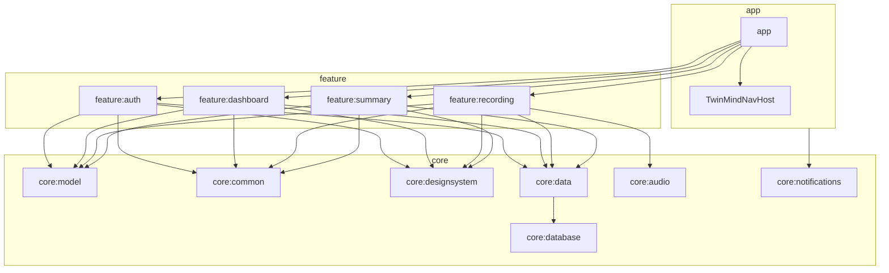
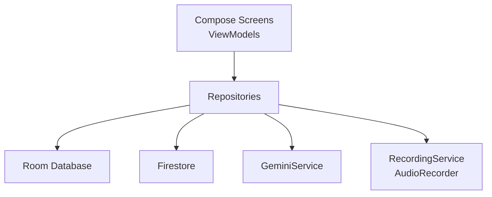

## TwinMind Android App


TwinMind is a modern Android app that turns your **spoken thoughts into structured memories** – transcripts, summaries, and AI-powered chats – all synced per user to Firebase.

This README is written as if it will live on GitHub and be read by other Android engineers, PMs, and designers who want to understand both **how the app works** and **how to work on it safely**.

## High-level Overview

- **Platform**: Native Android, Kotlin, Jetpack Compose, Hilt, Room, WorkManager.
- **Core workflows**:
  - Start a **recording session**, capture audio in the background.
  - Transcribe in **10s chunks** using **Gemini 2.5 Flash Lite**.
  - Generate summaries and AI chats based on the transcript.
  - Persist everything locally (Room) and to **Firestore**, per user.
  - Provide rich **Memories** (Notes & Chats) and **Dashboard** experience.
- **Design goals**:
  - Look and feel as close as possible to the original TwinMind iOS design.
  - Handle harsh real-world conditions (calls, low storage, process kills) gracefully.
  - Never lose user data once captured.

---

## Architecture

### Module Layout



**High-level roles:**

- **`app`**: Entry point, `MainActivity`, navigation graph (`TwinMindNavHost`).
- **`core:model`**: Pure Kotlin domain models (`Session`, `AudioChunk`, `TranscriptSegment`, `Summary`, `ChatMessage`).
- **`core:common`**: Dispatchers, shared utilities.
- **`core:designsystem`**: Theming, typography, reusable Compose components and icons.
- **`core:database`**: Room DB, entities, DAOs, migrations.
- **`core:data`**: Repositories, Gemini HTTP client, Firestore sync.
- **`core:audio`**: Audio recording engine (`AudioRecorder`), foreground `RecordingService`, shared `RecordingStateHolder`.
- **`core:notifications`**: Notification helpers, particularly for recording.
- **`feature:*`**: Screen-specific UI + ViewModels (`auth`, `dashboard`, `recording`, `summary`).

### Layered Design



- **UI layer (features)**:
  - Pure Compose UIs + `@HiltViewModel` ViewModels.
  - `StateFlow`-based unidirectional state flow into UI.
  - Navigation is entirely driven by typed routes (`NavKey` objects and data classes).

- **Data / Domain layer**:
  - Repositories hide persistence and network details.
  - Domain models live in `core:model` and are mapped to/from Room entities.

- **Infrastructure**:
  - `RecordingService` manages long-running recording with a **foreground notification**.
  - `WorkManager` does transcription and session finalization.


### Screenshots

> Replace the image paths with your own files (e.g. `docs/images/dashboard.png`) to make this section render on GitHub.

## Core Screens

| Dashboard | Recording | Session Detail |
|-----------|-----------|---------------|
|  |  |  |
| Hero mountain, Capture chip, View Digest pill, To-Do & Notes cards | Live waveform, elapsed time, low-storage bar state | Tabs: Summary / Notes / Transcript, AI summary & action items |


## Drawer & Personalization

| Navigation Drawer | Personalization |
|-------------------|----------------|
|  |  |
| Profile, PRO badge, Notes & Chats, Discord, Desktop CTA, astronaut promo card | Plant hero image, chips “Relevant / Personal / Useful” |


### Local Setup

1. **Clone the repo**

   ```bash
   git clone https://github.com/your-org/TwinMindTakeHome.git
   cd TwinMindTakeHome
   ```

2. **Configure API keys & Firebase**

   In `local.properties` (not committed):

   ```properties
   GEMINI_API_KEY=your_gemini_api_key_here
   ```

   Set up Firebase using the usual `google-services.json` flow and ensure `applicationId` matches your Firebase project.

3. **Build & run**

   - Open in Android Studio.
   - Sync Gradle.
   - Run the `app` module on a real device (recommended) with a microphone.

---

~ Kailash Sharma

