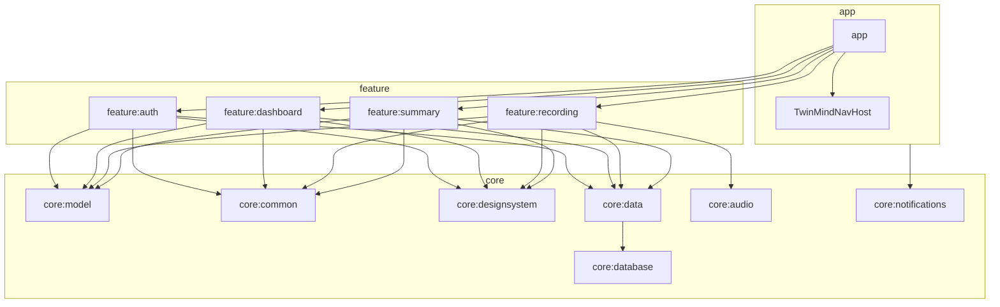
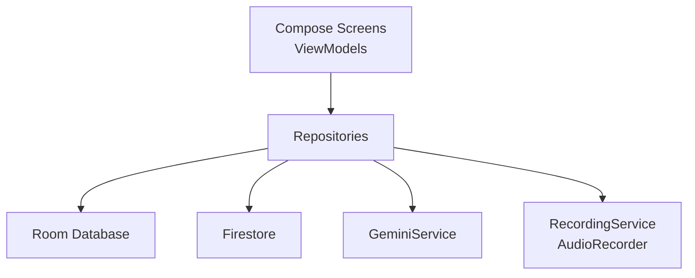
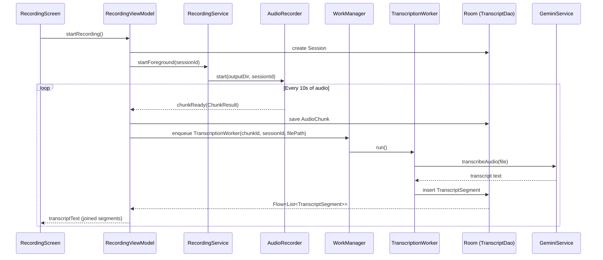

## TwinMind Android App

TwinMind is a modern Android app that turns your **spoken thoughts into structured memories** – transcripts, summaries, and AI-powered chats – all synced per user to Firebase.

This README is written as if it will live on GitHub and be read by other Android engineers, PMs, and designers who want to understand both **how the app works** and **how to work on it safely**.

---

## Table of Contents

- [High-level Overview](#high-level-overview)
- [Architecture](#architecture)
  - [Module Layout](#module-layout)
  - [Layered Design](#layered-design)
  - [Navigation Flow](#navigation-flow)
  - [Recording & Transcription Pipeline](#recording--transcription-pipeline)
  - [Data & Sync Architecture](#data--sync-architecture)
- [Edge Cases & Reliability](#edge-cases--reliability)
  - [Incoming / Outgoing Calls](#incoming--outgoing-calls)
  - [Audio Focus Loss](#audio-focus-loss)
  - [Microphone Source Changes](#microphone-source-changes)
  - [Low Storage](#low-storage)
  - [Process Death & Recovery](#process-death--recovery)
  - [Silent Audio Detection](#silent-audio-detection)
  - [Chunk Duration & Overlap](#chunk-duration--overlap)
  - [Android 16 Live Updates](#android-16-live-updates)
- [AI Integration (Gemini)](#ai-integration-gemini)
- [Authentication & Cloud Sync](#authentication--cloud-sync)
- [UI / UX Highlights](#ui--ux-highlights)
  - [Screenshots](#screenshots)
- [Getting Started](#getting-started)
- [Development Notes](#development-notes)

---

## High-level Overview

- **Platform**: Native Android, Kotlin, Jetpack Compose, Hilt, Room, WorkManager.
- **Core workflows**:
  - Start a **recording session**, capture audio in the background.
  - Transcribe in **10s chunks** using **Gemini 2.5 Flash Lite**.
  - Generate summaries and AI chats based on the transcript.
  - Persist everything locally (Room) and to **Firestore**, per user.
  - Provide rich **Memories** (Notes & Chats) and **Dashboard** experience.
- **Design goals**:
  - Look and feel as close as possible to the original TwinMind iOS design.
  - Handle harsh real-world conditions (calls, low storage, process kills) gracefully.
  - Never lose user data once captured.

---

## Architecture

### Module Layout



**High-level roles:**

- **`app`**: Entry point, `MainActivity`, navigation graph (`TwinMindNavHost`).
- **`core:model`**: Pure Kotlin domain models (`Session`, `AudioChunk`, `TranscriptSegment`, `Summary`, `ChatMessage`).
- **`core:common`**: Dispatchers, shared utilities.
- **`core:designsystem`**: Theming, typography, reusable Compose components and icons.
- **`core:database`**: Room DB, entities, DAOs, migrations.
- **`core:data`**: Repositories, Gemini HTTP client, Firestore sync.
- **`core:audio`**: Audio recording engine (`AudioRecorder`), foreground `RecordingService`, shared `RecordingStateHolder`.
- **`core:notifications`**: Notification helpers, particularly for recording.
- **`feature:*`**: Screen-specific UI + ViewModels (`auth`, `dashboard`, `recording`, `summary`).

### Layered Design



- **UI layer (features)**:
  - Pure Compose UIs + `@HiltViewModel` ViewModels.
  - `StateFlow`-based unidirectional state flow into UI.
  - Navigation is entirely driven by typed routes (`NavKey` objects and data classes).

- **Data / Domain layer**:
  - Repositories hide persistence and network details.
  - Domain models live in `core:model` and are mapped to/from Room entities.

- **Infrastructure**:
  - `RecordingService` manages long-running recording with a **foreground notification**.
  - `WorkManager` does transcription and session finalization.

### Navigation Flow

```mermaid
flowchart TD
  Splash[SplashRoute] -->|logged in| Dashboard[DashboardRoute]
  Splash -->|logged out| Onboarding[OnboardingRoute]
  Onboarding --> SignIn[SignInRoute]
  SignIn -->|success| Dashboard

  Dashboard --> Recording[RecordingRoute(recordingId)]
  Dashboard --> Memories[MemoriesRoute(initialTab)]
  Dashboard --> Personalization[PersonalizationRoute]

  Memories --> SessionDetail[SessionDetailRoute(sessionId)]
  SessionDetail --> Chat[ChatRoute(sessionId)]
```

Routes are typed (`NavKey` based) and defined in `app/src/main/java/com/takehome/twinmind/navigation/NavRoutes.kt`.

### Recording & Transcription Pipeline



**Chunking details:**

- Chunk size: **10 seconds** (`CHUNK_DURATION_MS = 10_000L`).
- Overlap: **2 seconds** between chunks to avoid cutting sentences.
- Result: transcript displayed with a delay of ~10–12 seconds from speech to text.

### Data & Sync Architecture

```mermaid
graph LR
  subgraph Local
    RDB[Room DB<br/>sessions, audio_chunks,<br/>transcript_segments,<br/>summaries, chat_messages]
  end

  subgraph Cloud
    FS[(Firestore)]
  end

  VM[ViewModels] --> REPO[Repositories]
  REPO --> RDB
  REPO --> FS

  subgraph Cloud Structure
    U[users/{uid}] --> S[user sessions/{sessionId}]
  end
```

- Every `Session` is persisted locally first, then synced to Firestore via `CloudSyncRepository`.
- Firestore document per user + sub-collection `sessions` holds transcript, summary, notes, and chat, keyed by sessionId.

---

## Edge Cases & Reliability

This app is designed for **real-world recording**. These are the key edge cases and how they’re handled.

### Incoming / Outgoing Calls

- **Goal**: Pause recording on phone call, resume afterwards, without crashing or corrupting audio.
- **Implementation**:
  - `RecordingService` registers a **`TelephonyCallback` / `PhoneStateListener`**.
  - On call start → `pauseRecording("Paused - Phone call")`.
  - On call end → `resumeRecording()` if pause reason was phone call.
  - UI shows `"Paused - Phone call"` and recording does not progress.

### Audio Focus Loss

- **Goal**: Pause when another app grabs the mic (e.g., voice call, another recorder).
- **Implementation**:
  - `AudioManager` + `AudioFocusRequest` inside `RecordingService`.
  - On `AUDIOFOCUS_LOSS` / `AUDIOFOCUS_LOSS_TRANSIENT` → pause with reason `"Paused - Audio focus lost"`.
  - On `AUDIOFOCUS_GAIN` → resume only if the pause reason matches.
  - Foreground notification text reflects `"Paused – Audio focus lost"` and exposes Resume/Stop.

### Microphone Source Changes

- **Goal**: Don’t stop recording when changing audio devices (headphones, Bluetooth).
- **Implementation**:
  - `BroadcastReceiver` for:
    - `AudioManager.ACTION_HEADSET_PLUG`
    - `BluetoothAdapter.ACTION_CONNECTION_STATE_CHANGED`
  - `AudioDeviceCallback` for newer APIs.
  - On change → show **non-blocking info** in UI (`micSourceChanged` in `RecordingState`) and in the notification:
    - “Wired headset connected / disconnected”
    - “Bluetooth audio connected / disconnected”
  - Recording continues uninterrupted.

### Low Storage

- **Goals**:
  - Never crash on low storage.
  - Don’t allow recording to start when storage is almost full.
  - Stop gracefully mid-recording when storage runs out.
- **Implementation**:
  - `RecordingService` checks `StatFs` **after** calling `startForeground` to avoid `ForegroundServiceDidNotStartInTimeException`, but **before** starting recording.
  - If low storage is detected:
    - Service emits an error state (`errorMessage = "Recording stopped - Low storage"`).
    - UI shows a dedicated **Low Storage bar** with CTA to go back home.
    - Recording controls are disabled; waveform and Stop button are hidden.
  - During recording:
    - `AudioRecorder` wraps writes in `try/catch(IOException)` to handle `ENOSPC` (no space left) and breaks recording gracefully instead of crashing.

### Process Death & Recovery

- **Goal**: If the app or process is killed while recording, finalize the session and resume transcription when the user returns.
- **Implementation**:
  - `RecordingService.onTaskRemoved()`:
    - Stops `AudioRecorder`.
    - Enqueues a `SessionTerminationWorker`.
  - `SessionTerminationWorker`:
    - Marks the session as `COMPLETED`.
    - Re-enqueues `TranscriptionWorker` for any pending or failed chunks.
  - On app restart, the Dashboard and Memories screens show the recovered session and transcript.

### Silent Audio Detection

- **Goal**: Detect long periods of silence and gently warn the user.
- **Implementation**:
  - `AudioRecorder` computes RMS amplitude per buffer.
  - If amplitude < threshold for > 10 seconds → emits `silenceDetected = true`.
  - `RecordingViewModel` exposes `silenceWarning` in `RecordingUiState`.
  - UI shows “No audio detected – check microphone” while still recording.

### Chunk Duration & Overlap

- **Chunk duration**: 10 seconds (`CHUNK_DURATION_MS`).
- **Overlap**: 2 seconds (`OVERLAP_MS`) between consecutive chunks.
- **Motivation**:
  - Shorter chunks → faster perceived “real-time” transcript.
  - Overlap avoids cutting sentences across chunk boundaries, improving summary quality.

### Android 16 Live Updates

- **Goal**: Show live recording status on lock screen for devices with Android 16+.
- **Implementation**:
  - `RecordingService` builds notifications using `Notification.ProgressStyle` on API 36+.
  - Shows:
    - Elapsed timer.
    - Status (“Recording”, “Paused – Phone call”, etc.).
    - Actions: Pause / Stop where supported.
    - Mic icon / visual indicator.

---

## AI Integration (Gemini)

- **Client**: Custom HTTP client (`OkHttp`) in `GeminiService`.
- **Key endpoints**:
  - `generateContent` for transcription & summaries.
  - `streamGenerateContent` (SSE) for streaming chat and summaries.
- **Model**: `gemini-2.5-flash-lite`.
- **Security**:
  - API key loaded from `BuildConfig.GEMINI_API_KEY` (backed by `local.properties`).
  - Key never checked into version control.

---

## Authentication & Cloud Sync

- **Auth**: Google Sign-In via `CredentialManager + GetGoogleIdOption` and `FirebaseAuth`.
- **Flow**:
  - `AuthRepository.signInWithGoogle()` → get credential → `FirebaseAuth.signInWithCredential`.
  - `AuthViewModel` exposes `AuthUiState(isSignedIn, userName, error)`.
  - `TwinMindNavHost` reacts to `isSignedIn` and navigates to Dashboard.
- **Cloud sync** (`CloudSyncRepository`):
  - Writes under `users/{uid}` in Firestore.
  - `sessions/{sessionId}` sub-documents with:
    - Session metadata (status, timestamps, title, notes, location).
    - Transcript, summary (title + text), key points, action items.
    - Chat history.
  - Defensive null handling: only non-null fields are written to avoid overwriting existing values with nulls.

---

## UI / UX Highlights

- Pixel-perfect reproduction of:
  - **Dashboard**: hero image, chips, info cards with gradients, fixed Capture Notes button.
  - **View Digest**: green gradient pill, bottom sheet explaining unlock conditions.
  - **Drawer**: profile section, search bar, astronaut promo card.
  - **Personalization**: plant hero image with chip labels.
  - **Onboarding**: 3-page swipeable flow with matching designs.
  - **Recording Screen**: full-width recording pill, low storage state, mic-source banners.
  - **Session Detail**: tabs for Summary, Notes, Transcript with beautiful layout.

### Screenshots

> Replace the image paths with your own files (e.g. `docs/images/dashboard.png`) to make this section render on GitHub.

#### Core Screens

| Screen         | Light Mode                                                | Notes |
|----------------|-----------------------------------------------------------|-------|
| Dashboard      |                   | Hero mountain, Capture chip, View Digest pill, To-Do & Notes cards |
| Recording      |                   | Live waveform, elapsed time, low-storage bar state |
| Session Detail |         | Tabs: Summary / Notes / Transcript, AI summary & action items |

#### Auth & Onboarding

| Screen      | Screenshot                                                 | Notes |
|-------------|------------------------------------------------------------|-------|
| Splash      |                           | Radial gradient TwinMind logo |
| Onboarding  |                 | Three-step introduction with full-screen illustrations |
| Sign In     |                         | Google Sign-In with terms notice |

#### Drawer & Personalization

| Screen              | Screenshot                                            | Notes |
|---------------------|-------------------------------------------------------|-------|
| Navigation Drawer   |                     | Profile, PRO badge, Notes & Chats, Discord, Desktop CTA, astronaut promo card |
| Personalization     |   | Plant hero image, chips “Relevant / Personal / Useful” |

---

## Getting Started

### Prerequisites

- Android Studio Hedgehog / Koala or newer.
- JDK 11.
- A **Gemini API key** from Google AI Studio.
- A Firebase project with:
  - Firebase Authentication (Google sign-in) enabled.
  - Firestore in Native mode.

### Local Setup

1. **Clone the repo**

   ```bash
   git clone https://github.com/your-org/TwinMindTakeHome.git
   cd TwinMindTakeHome
   ```

2. **Configure API keys & Firebase**

   In `local.properties` (not committed):

   ```properties
   GEMINI_API_KEY=your_gemini_api_key_here
   ```

   Set up Firebase using the usual `google-services.json` flow and ensure `applicationId` matches your Firebase project.

3. **Build & run**

   - Open in Android Studio.
   - Sync Gradle.
   - Run the `app` module on a real device (recommended) with a microphone.

---

## Development Notes

- **Transcription “real-time” expectations**:
  - Because we use 10s chunks + cloud transcription, expect transcript updates with a ~10–15s delay, not true per-word streaming.
  - To experiment with faster updates, you can reduce `CHUNK_DURATION_MS` in `AudioRecorder`, but this increases WorkManager load and API calls.

- **Where to look when debugging**:
  - Recording / chunks: `core/audio/AudioRecorder.kt`, `RecordingService.kt`, `RecordingViewModel.kt`.
  - Transcription: `core/data/ai/TranscriptionWorker.kt`, `GeminiService.kt`, `TranscriptRepository.kt`.
  - Session loading / summary: `SessionDetailViewModel.kt`, `SummaryBottomSheet.kt`, `SummaryRepository.kt`.
  - Cloud sync: `CloudSyncRepository.kt`, Firestore console.
  - Auth & onboarding: `feature/auth/*`, `TwinMindNavHost.kt`.

- **Logging**:
  - `Timber` is used extensively with tags like `TM_TRANSCRIPT` to trace transcript lifecycle.

- **Safe changes**:
  - Prefer modifying **feature modules** (`feature:*`) and `core:designsystem` for UI / UX tweaks.
  - Be cautious editing `core:audio`, `core:data`, `core:database` – these directly affect reliability and data integrity.

If you’re extending the app (e.g., new AI features, richer memories, more edge cases), keeping these architectural boundaries and behaviors intact will help you move fast without breaking existing flows.

